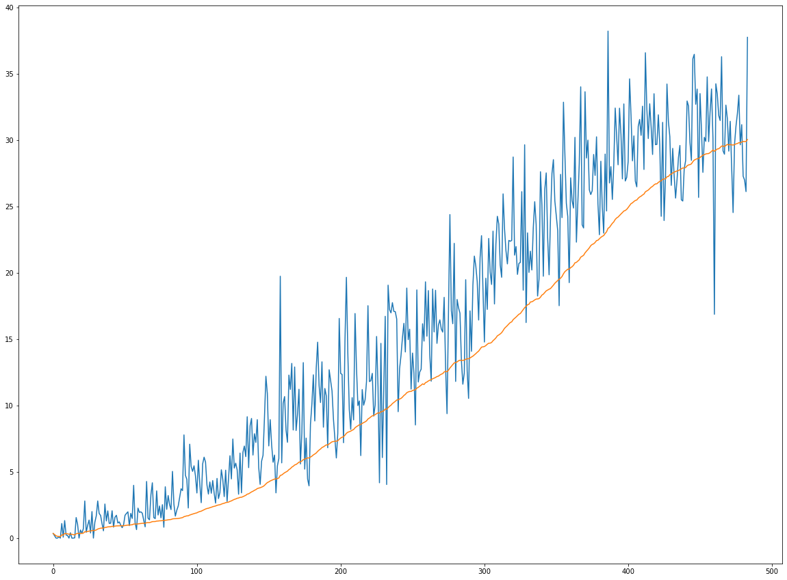
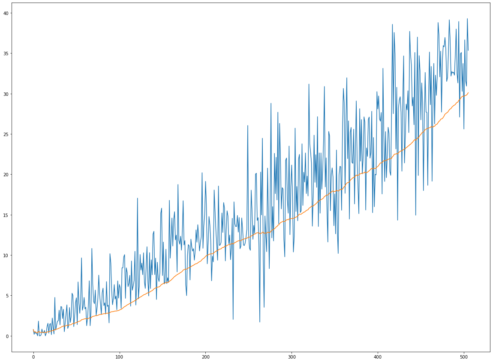

# P2-Continuous Control
 Project 2 of Continuous Control from the Udacity's Nanodegree program with implementation of two versions of the DDPG algorithm (with uniform sampling and prioritised sampling of the replay buffer)


# Installation
Clone this GitHub repository, create a new conda environment and install all the required libraries using the frozen `conda_requirements.txt` file.
```shell
$ git clone https://github.com/dimartinot/P2-Continuous-Control.git
$ cd P2-Continuous-Control/
$ conda create --name drlnd --file conda_requirements.txt
``` 

If you would rather use pip rather than conda to install libraries, execute the following:
```shell
$ pip install -r requirements.txt
```
*In this case, you may need to create your own environment (it is, at least, highly recommended).*

# Usage
Provided that you used the conda installation, your environment name should be *drlnd*. If not, use `conda activate <your_env_name>` 
```shell
$ conda activate drlnd
$ jupyter notebook
```

# Code architecture
This project is made of two main jupyter notebooks using classes spread in multiple Python file:
## Jupyter notebooks
- `Navigation.ipynb`: notebook of the code execution. It loads the weight file of the model and execute 5 runs of the environment while averaging, at the end, the score obtained in all these environment (make sure to have provided the correct path to the Banana exe file). 
- `project_nagivation.ipynb`: notebook containing the training procedure (see especially the `dqn` method for details).

## Python files
 - `ddpg_agent.py`: Contains the class definition of the basic DPPG learning algorithm that uses soft update (for weight transfer between the local and target networks) as well as a uniformly distributed replay buffer and OUNoise to model the exploration/exploitation dilemma;
 - `model.py`:  Contains the PyTorch class definition of the Actor and the critic neural networks, used by their mutual target and local network's version;
 - `prioritized_ddpg_agent.py`: Contains the class definition of the DDPG learning algorithm with prioritized replay buffer.

where p is the lastly measured td error of the experience tuple, before its insertion in the buffer. Alpha is an hyperparameter: the closer alpha is to zero, the more uniform the sampling distribution will be. The closer to one, the less uniform it will be. As a default, the alpha value used in this project was 0.9.

## PyTorch weights
4 weight files are provided, two for each agent (critic + actor): as they implement the same model, they are interchangeable. However, as a different training process has been used, I found it interesting to compare the resulting behaviour of the agent:
 - `actor_weights_simple_replay_buffer.pth` & `critic_weights_simple_replay_buffer.pth`: these are the weights of a *common* ddpg agent using a uniformly distributed replay buffer.
 
 
 <figure style="  
   float: right;
   width: 30%;
   text-align: center;
   font-style: italic;
   font-size: smaller;
   text-indent: 0;
   border: thin silver solid;
   margin: 0.5em;
   padding: 0.5em;
  ">
  
  <figcaption style="text-align:center;font-style:italic"><i><small>Plot of the score (blue end of episode score, orange moving average score) for a DPPG agent trained with uniform replay buffer</small></i></figcaption>
  <br>
</figure> 
 
 - `actor_weights_prioritised_replay_buffer.pth` & `critic_weights_prioritised_replay_buffer.pth`: these are the weights of an agent trained with experience tuple sampled using their *importance* in the learning process.

 <figure style="  float: right;
   width: 30%;
   text-align: center;
   font-style: italic;
   font-size: smaller;
   text-indent: 0;
   border: thin silver solid;
   margin: 0.5em;
   padding: 0.5em;">
  
  <figcaption><i><small>Plot of the score (blue end of episode score, orange moving average score) for a DPPG agent trained with prioritised replay buffer</small></i></figcaption>
</figure> 

